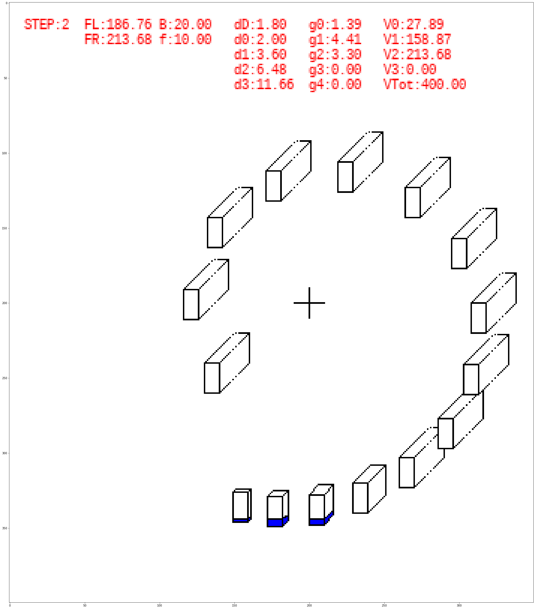
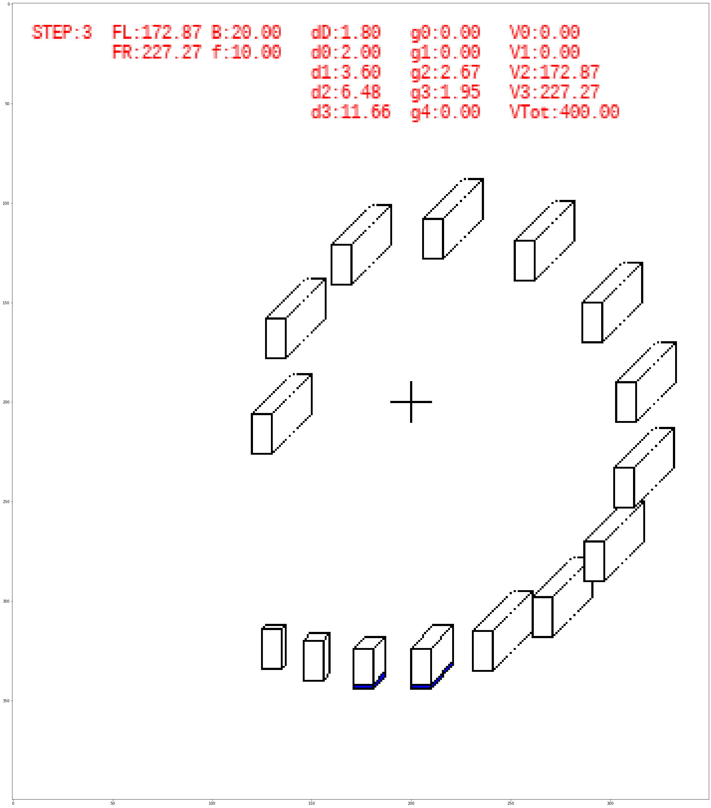

plan2.7z -> blender file
             watch me fail ... theretically mass of right is > than mass of left (water simulated by alot of spheres)
                           ... but for some reason the rotation stops (was expecting it to continue till all balls fall off)
                           ... guess I need some more brain cells to figure out what force stops it from rotating :-/
                           ... well of course I know the other way around would be confusing, too

Theory:

Step 2 and 3 are actually work in progress.

Some containers on the left should also be filled.

But does not change the theory. (with enough depth-increase counter-clockwise it should negate the effect)